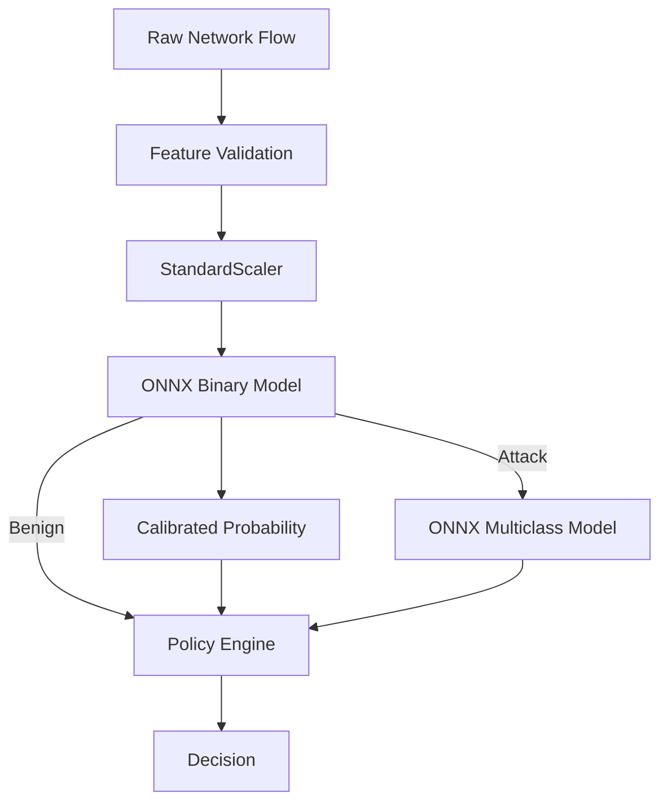

# 🚀 CyberSentinel-AI

Production-Grade Machine Learning Intrusion Detection System (IDS)

---

⚡ Overview

CyberSentinel-AI is a production-grade Machine Learning Intrusion Detection System (IDS) designed to detect malicious network traffic in real-time and map it into actionable security decisions.

Unlike traditional rule-based systems, CyberSentinel leverages:

- Behavioral analysis
- Ensemble learning
- Calibrated probabilistic outputs
- High-speed ONNX inference

---

🎯 Problem Statement

Traditional IDS systems:

- ❌ Depend on signatures
- ❌ Fail on zero-day attacks
- ❌ Struggle with encrypted / obfuscated traffic

CyberSentinel-AI solves this by:

- ✅ Learning traffic behavior
- ✅ Generalizing across unseen patterns
- ✅ Producing trust-aware decisions

---

🧠 Key Capabilities

- 🔍 Binary Classification → Benign vs Attack
- 🧠 Multi-class Classification → 14 attack categories
- ⚡ ONNX Runtime → millisecond inference
- 📊 Calibrated Trust Scores → real probabilities
- 🛡 Policy Engine → ALLOW / QUARANTINE / DENY
- 🔗 Modular API + Dashboard architecture

---

🏗️ System Architecture

🔷 High-Level Pipeline

---

🔬 Inference Flow Breakdown

Input Flow
   ↓
Feature Validation (Strict Schema)
   ↓
Scaling (StandardScaler)
   ↓
Binary Classifier (ONNX)
   ↓
Calibrated Probability (Isotonic)
   ↓
Conditional Multiclass (ONNX)
   ↓
Policy Mapping
   ↓
Final Decision

---

📊 Dashboard Preview

🔮 Prediction Interface

"Prediction" (docs/assets/predict.png)

---

📊 Evaluation Metrics

"Evaluation" (docs/assets/evaluation.png)

---

⚙️ Policy Mapping

"Policy" (docs/assets/policy.png)

---

🎥 Demo

---

🏆 Model Performance

Binary Classification

Accuracy   : 0.9983
F1 Score   : 0.9983
ROC-AUC    : 0.9999

Multi-class Classification

Accuracy   : 0.9972
F1 Macro   : 0.88 – 0.91
ROC-AUC    : ~0.9995

---

⚙️ ML Pipeline (Training Flow)

1. Feature Selection
2. Data Preprocessing
3. Binary Model Training
4. Multi-class Model Training
5. Evaluation
6. Policy Mapping
7. Inference Pipeline
8. API Deployment
9. Dashboard

---

🧪 Testing & Validation

ONNX vs Scikit Parity

pytest tests/test_onnx_parity.py

Edge Case Validation

python tests/test_edge_cases.py

Covered Cases

- Missing features → HTTP 422
- NaN / Inf injection → rejected
- ONNX output corruption → guarded

---

🚀 Quickstart

1. Setup

git clone <https://github.com/><your-username>/cybersentinel-ai.git
cd cybersentinel-ai

python -m venv venv
venv\Scripts\activate
pip install -r requirements.txt

---

1. Run Full Pipeline

python -m src.pipeline.pipeline_runner
python -m src.pipeline.export_onnx

---

1. Start API

uvicorn src.api.main:app --reload

---

1. Launch Dashboard

streamlit run src/dashboard/app.py

---

🐳 Docker Deployment

docker build -t cybersentinel-ai .

docker run -d \
  -p 8000:8000 \
  -v $(pwd)/models:/app/models \
  cybersentinel-ai

⚠️ Models are not bundled inside container.

---

🔌 API Usage

POST /predict

curl -X POST "<http://localhost:8000/predict>" \
     -H "Content-Type: application/json" \
     -d '{"features": {...}}'

Response

{
  "action": "ALLOW",
  "confidence": 0.87,
  "attack_type": null,
  "reason": "Traffic classified as benign."
}

---

🧠 Engineering Highlights

⚡ ONNX Acceleration

- Eliminates Python bottleneck
- Enables millisecond inference

📊 Probability Calibration

- "CalibratedClassifierCV"
- Converts tree outputs → real probabilities

🛡 Input Safety

- Strict schema validation
- No silent failures
- Rejects malformed payloads

🔄 Concurrency Handling

- ThreadPoolExecutor
- Prevents API blocking

---

📂 Project Structure

src/
├── api/
├── core/
├── dashboard/
├── features/
├── inference/
├── models/
├── pipeline/
├── policy/
└── training/

---

📌 Future Scope

- SHAP Explainability (async workers)
- Streaming Feature Engine (Zeek)
- Kubernetes Deployment
- Adaptive Trust Framework (ATF)

---

👨‍💻 Author

Shuchi Anush S
<https://github.com/Shuchi-Anush>

---

📜 License

MIT License
