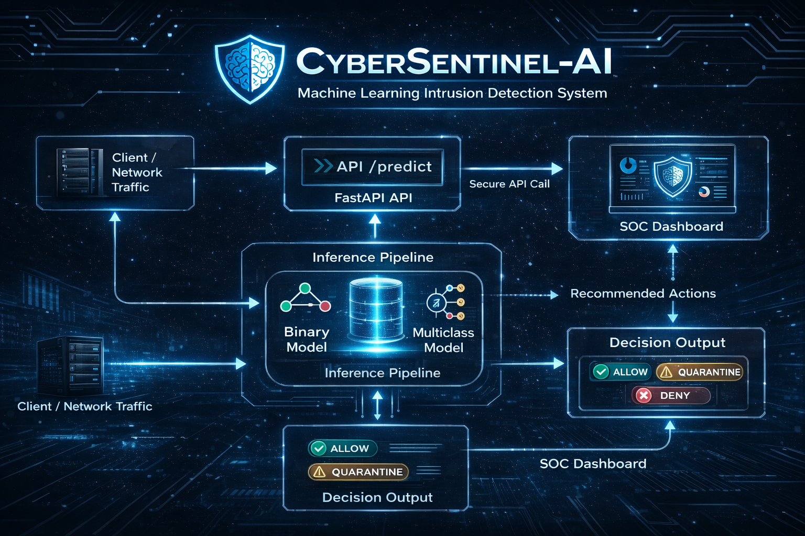

<!-- markdownlint-disable MD033 -->
<!-- markdownlint-disable MD045 -->

# 🛡️ CyberSentinel-AI

<p align="center">
  
</p>

<p align="center">
  <b>From Network Traffic → To Security Decisions in Real-Time</b><br>
  <sub>A Production-Grade Machine Learning Intrusion Detection System</sub>
</p>

<p align="center">
  
  
  
  
  
</p>

---

## ⚡ 5-Second Pitch

CyberSentinel-AI is not a model.

It is a **real-time decision engine** that transforms raw network flows into:

```text
ALLOW  |  QUARANTINE  |  DENY
```

— automatically, instantly, and at scale.

---

## 🧠 Problem → Solution

### ❌ Traditional Systems

* Signature-based detection
* Fail on zero-day attacks
* Require manual intervention
* High alert fatigue

### ✅ CyberSentinel-AI

* Behavioral ML detection
* Detects unknown attack patterns
* Fully automated response
* Real-time policy enforcement

---

## 🚀 What Makes This Different

| Capability     | Typical ML Project | CyberSentinel-AI  |
| -------------- | ------------------ | ----------------- |
| Scope          | Model only         | Full ML system    |
| Output         | Prediction         | Decision + Action |
| Runtime        | Notebook           | Production API    |
| Explainability | None               | Feature signals   |
| Deployment     | Local              | Docker + API      |
| UX             | None               | SOC Dashboard     |

---

## 🏗️ System Thinking (Core Idea)

This system replaces:

```text
Detect → Alert → Human → Decide → Act
```

With:

```text
Detect → Classify → Decide → Act   (Fully Automated)
```

---

## 🔥 Real-World Scenario

> Incoming traffic spike from unknown source

1. Flow enters system
2. Binary model detects anomaly
3. Multiclass model identifies: **DoS slowloris**
4. Policy engine evaluates risk
5. System responds:

```text
🔴 DENY (Instant)
```

No human required.

---

## 🏛️ Architecture

<p align="center">
  
</p>

---

## 🧠 Core Pipeline

```text
Input
 ↓
Validation (Schema Guard)
 ↓
Scaling (Precomputed)
 ↓
Binary Detection (Benign vs Attack)
 ↓
Multiclass Classification (Attack Type)
 ↓
Policy Mapping
 ↓
Action (ALLOW / QUARANTINE / DENY)
```

<p align="center">
  
</p>

---

## 📊 Performance (Real Data)

### Binary Model

* Accuracy: **0.9983**
* ROC-AUC: **0.9999**

### Multiclass Model

* Accuracy: **0.9976**
* F1 (macro): **~0.89**
* Classes: **14**

---

## ⚙️ Production Characteristics

* Stateless API (FastAPI)
* Deterministic inference
* Config-driven policies
* ONNX-compatible pipeline
* Safe input validation (Pydantic)
* Zero random behavior in inference

---

## 🖥️ SOC Dashboard

<p align="center">
  
</p>

<p align="center">
  
</p>

<p align="center">
  
</p>

---

## 🔬 Decision Intelligence

The system does not just predict.

It provides:

* Threat severity (Low / Medium / High)
* Confidence scores
* Attack type classification
* Policy reasoning

---

## ⚡ Quick Start

### 1. Setup

```bash
git clone https://github.com/Shuchi-Anush/cybersentinel-ai.git
cd cybersentinel-ai

python -m venv venv
venv\Scripts\activate
pip install -r requirements.txt
```

---

### 2. Train Pipeline

```bash
python -m src.pipeline.pipeline_runner
```

---

### 3. Start API

```bash
uvicorn src.api.main:app --host 0.0.0.0 --port 8000
```

---

### 4. Launch Dashboard

```bash
streamlit run src/dashboard/app.py
```

---

## 🐳 Docker Deployment

```bash
docker build -t cybersentinel-ai .

docker run -p 8000:8000 \
  -v $(pwd)/models:/app/models \
  cybersentinel-ai
```

---

## 📡 API Example

### Request

```json
POST /predict
{
  "features": {
    "Flow Duration": 128941,
    "Total Fwd Packets": 4
  }
}
```

### Response

```json
{
  "action": "DENY",
  "confidence": 0.98,
  "attack_type": "DoS slowloris"
}
```

---

## 📁 Clean Architecture

```text
src/
├── features/      # Preprocessing & feature selection
├── training/      # ML models (binary + multiclass)
├── inference/     # Prediction pipeline
├── policy/        # Decision logic
├── api/           # FastAPI service
├── dashboard/     # Streamlit SOC UI
```

---

## 🧩 Key Insight

Most projects stop at prediction.

CyberSentinel-AI goes further:

```text
Prediction → Decision → Action
```

That is the difference between a model and a **system**.

---

## 👨‍💻 Author

**Shuchi Anush S**
🔗 [https://github.com/Shuchi-Anush](https://github.com/Shuchi-Anush)

---

## 📜 License

MIT License
