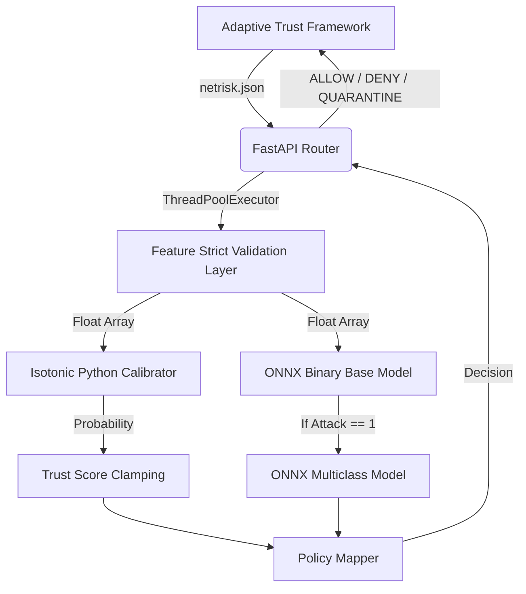

# 🚀 CyberSentinel-AI (ATF ML Core)


CyberSentinel-AI is the **Machine Learning Inference Engine** designed for the **Adaptive Trust Framework (ATF)**. It acts as an intrusion detection system (IDS), digesting streaming network metrics and producing absolute, mathematically secure Bayesian Trust Scores for policy orchestration.

---

## 🏗️ Architecture

CyberSentinel-AI operates as a highly uncoupled ML Core. It exclusively ingests processed `netrisk.json` packets and resolves them using a dual-state `scikit-learn` and `ONNX` execution pipeline. 



### The Inference Cascade
1. **Validation**: HTTP inputs are forcefully evaluated via Pydantic bounding dropping injected `NaN` or un-tracked dimensions immediately returning `HTTP 422`.
2. **ONNX Speed**: Multidimensional float models bypass Python Global Interpreters completely resolving tree-branching sub-10ms via native `ONNXRuntime` C-backends.
3. **Isotonic Calibration**: Organic Pytest/Scikit execution wrappers wrap `CalibratedClassifierCV(method="isotonic")` to convert native forest algorithms into probabilistic trust vectors.

---

## 🚀 Quickstart & Usage

### ⚙️ Using Python (Local)

1. Clone and initialize:
```bash
python -m venv venv
venv\Scripts\activate
pip install -r requirements.txt
```

2. Generate or ensure that `/models/` artifacts exists (the system leverages decoupled storage parameters natively skipping massive Git limits):
```bash
# Verify the entire pipeline and generate binary constraints + ONNX bounds
python -m src.pipeline.pipeline_runner
python -m src.pipeline.export_onnx
```

3. Launch components:
```bash
# Launch FastAPI Engine:
uvicorn src.api.main:app --port 8000 --workers 4

# Launch Dashboard UI:
streamlit run src/dashboard/app.py
```

### 🐳 Using Docker

The containerized environment operates as a stripped, non-root hardened deployment layer.

**Note:** The `/models/` directory is **deliberately excluded** from the Docker build layer securing image agility. It **MUST** be mapped as a runtime volume natively.

```bash
docker build -t cybersentinel-ai .
docker run -d --name ids-engine \
    -p 8000:8000 \
    -v $(pwd)/models:/app/models \
    cybersentinel-ai
```

---

## 🔌 API Documentation

All parameters are heavily bounded to exact geometry definitions generated by `features.pkl` natively.

**POST `/predict`**
```bash
curl -X POST "http://localhost:8000/predict" \
     -H "Content-Type: application/json" \
     -d '{
           "features": {
               "Flow Duration": 100,
               "Total Fwd Packets": 2,
               ... [40 exact selected parameters]
           }
         }'
```

**Response Example:**
```json
{
  "action": "ALLOW",
  "confidence": 0.814,
  "attack_type": "Benign",
  "reason": "Traffic classified as benign."
}
```

---

## 🧠 Model Geometry & Math

* **Class Balancing**: We strictly avoided synthetic generation matrices like `SMOTE` maintaining geometric purity via `class_weight="balanced_subsample"` to accurately classify 14 extreme minority network attacks organic toCICIDS2017 matrices.
* **Concurrency**: Bounded explicitly to `ThreadPoolExecutor(max_workers=4)` ensuring ASGI events successfully delegate parallel mathematical matrix processing without starving the underlying IO subsystem loop.
* **Calibration**: Base binary outputs lack pure probabilistic meaning natively. `CalibratedClassifierCV` transforms voting thresholds into raw statistical confidence.

---

*Authored by the CyberSentinel ML-LAB*
