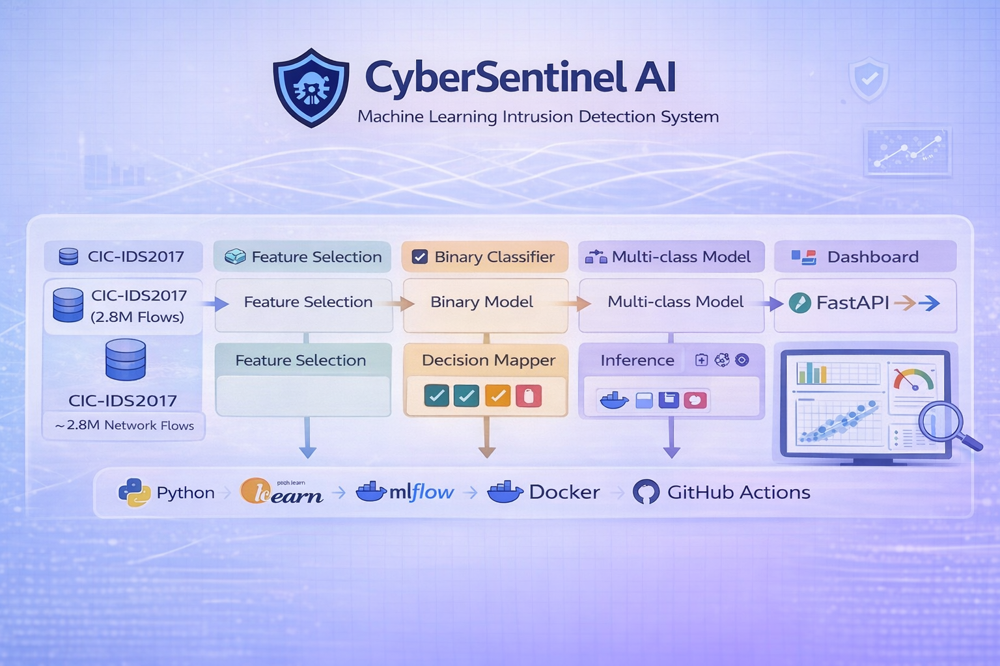
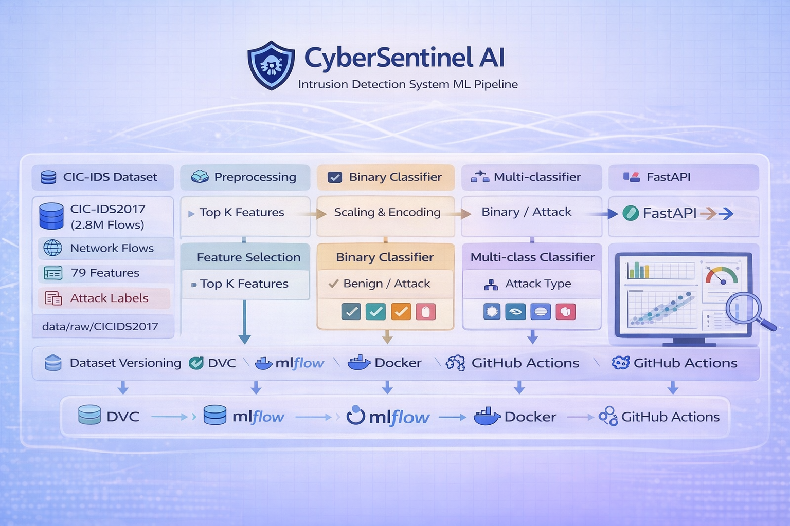

# 🚀 CyberSentinel AI



## Machine Learning Powered Intrusion Detection System


CyberSentinel AI is a **Machine Learning-based Intrusion Detection System (IDS)** designed to detect malicious network traffic using the **CIC-IDS2017 dataset**.

The project implements a **modular MLOps-ready machine learning pipeline for intrusion detection**, including:

- Dataset versioning (DVC)
- Experiment tracking (MLflow)
- Automated CI pipelines
- Containerized deployment
- FastAPI inference API
- Streamlit threat analytics dashboard

---

## 🧠 System Overview

Modern networks generate massive traffic volumes, making manual monitoring impossible.

CyberSentinel AI applies **machine learning models trained on network flow statistics** to automatically detect malicious traffic patterns such as:

- Distributed Denial of Service (DDoS)
- Botnet traffic
- Port scanning
- Brute force attacks
- Web attacks

Each dataset row represents a **network flow summary**, not raw packets.

---

## 🎬 System Preview

Dashboard demo will be available after the first working release of the
CyberSentinel AI intrusion detection pipeline.

CyberSentinel AI analyzes network flow statistics and detects malicious traffic patterns using machine learning.

The system provides:

- real-time intrusion predictions via API
- experiment tracking through MLflow
- security analytics dashboard

Example workflow:

1️⃣ Feature selection from CIC-IDS2017  
2️⃣ Data preprocessing and feature engineering  
3️⃣ Binary classifier  
4️⃣ Multi-class classifier  
5️⃣ Decision mapping
6️⃣ FastAPI inference API
7️⃣ Streamlit dashboard visualization

---

## ✴️ Key Features

- CIC-IDS2017 cybersecurity dataset integration
- Feature selection pipeline
- Data preprocessing and scaling
- Binary attack detection model
- Multi-class attack classification model
- Decision / policy mapping
- Inference pipeline
- FastAPI inference API
- Docker containerization
- GitHub Actions CI pipeline
- Model registry / experiment tracking

---

## 🏗 System Architecture



```text
CIC-IDS2017 Dataset
↓
Feature Selection
↓
Preprocessing
↓
Binary Classifier (Benign / Attack)
↓
Multi-class Classifier (Attack Type)
↓
Decision Mapping
↓
Inference Pipeline
↓
FastAPI API
↓
Dashboard / Integration
```

---

## 🧰 Technology Stack

| Layer                 | Technology        |
| --------------------- | ----------------- |
| Programming           | Python 3.10       |
| Data Processing       | Pandas, NumPy     |
| Machine Learning      | Scikit-learn      |
| Experiment Tracking   | MLflow            |
| Dataset Versioning    | DVC               |
| Backend API           | FastAPI           |
| Visualization         | Streamlit         |
| Containerization      | Docker            |
| CI/CD                 | GitHub Actions    |

---

## 📂 Project Structure

```text
cybersentinel-ai/

├── configs/
├── data/
├── docs/
├── notebooks/
├── scripts/
├── src/
├── tests/
├── Dockerfile
├── Makefile
└── requirements.txt
```

---

## 📊 Dataset

CyberSentinel AI uses the **CIC-IDS2017 dataset** developed by the Canadian Institute for Cybersecurity.

Dataset characteristics:

- ~2.8 million network flows
- 79 network traffic features
- Multiple attack categories
- Realistic enterprise network traffic

Download the dataset:

[CIC IDS 2017 Dataset](https://www.unb.ca/cic/datasets/ids-2017.html)

Place the CSV files inside:

`data/raw/CICIDS2017/`

---

## 🚀 Installation

Clone the repository:

```bash
git clone https://github.com/Shuchi-Anush/cybersentinel-ai.git
cd cybersentinel-ai
```

Install dependencies:

```bash
pip install -r requirements.txt
```

---

## ▶️ Train Binary Model

```bash
python -m src.training.binary_trainer
```

## ▶️ Train Multi-class Model

```bash
python -m src.training.multiclass_trainer
```

## ▶️ Run API

```bash
uvicorn src.api.main:app --reload
```

Open in browser:

<http://127.0.0.1:8000/docs>

---

## 📊 Launch MLflow Tracking

```bash
mlflow ui
```

Open in browser:

<http://127.0.0.1:5000>

---

## 📈 Launch Security Dashboard

```bash
streamlit run src/dashboard/app.py
```

---

## 🐳 Docker Deployment

Build Docker image:

```bash
docker build -t cybersentinel .
```

Run container:

```bash
docker run -p 8000:8000 cybersentinel
```

---

## 🔁 Continuous Integration

GitHub Actions automatically runs tests on every push.

Workflow file:

`.github/workflows/ci.yml`

---

## 📍 Project Status

CyberSentinel AI is currently under active development.

Completed components:

- [X] Project architecture  
- [X] Feature selection
- [X] Preprocessing pipeline
- [X] Binary classifier
- [ ] Multi-class classifier
- [X] FastAPI base API
- [X] Docker environment
- [X] CI pipeline

Upcoming components:

- [ ] Multi-class evaluation
- [ ] Decision mapping module
- [ ] Dashboard visualization
- [ ] Model tuning

---

## 📌 Future Enhancements

- Real-time packet capture using Scapy
- Deep learning IDS models
- Cloud deployment
- Model drift monitoring
- Distributed ML pipeline

---

## 👨‍💻 Author

Shuchi Anush S

GitHub:  
<https://github.com/Shuchi-Anush>

---

## 📜 License

This project is licensed under the **MIT License**.
