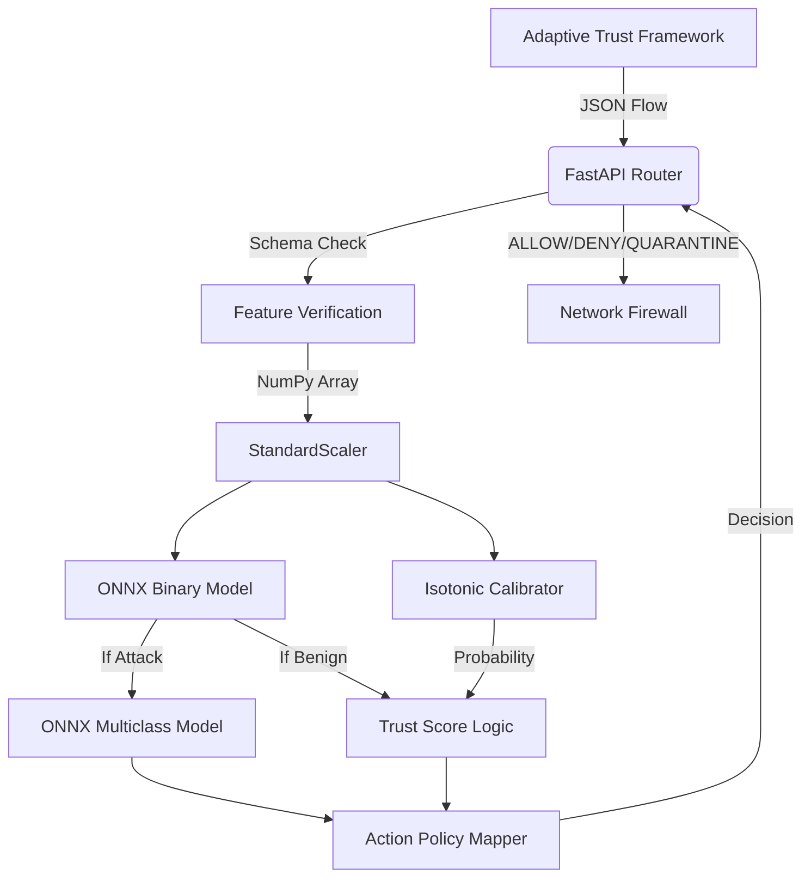

<!-- markdownlint-disable MD033 -->

<h1 align="center">CyberSentinel-AI</h1>

<div align="center">
  

  <h3>Machine Learning Intrusion Detection System</h3>

  
  
  
  
  
  
  
</div>

---

## Overview

CyberSentinel-AI is a high-performance Machine Learning Intrusion Detection System (IDS). Designed as the inference core for the Adaptive Trust Framework (ATF), it identifies malicious network traffic in real time and maps threats to actionable security policies.

By modeling the CIC-IDS-2017 dataset, CyberSentinel profiles anomalous traffic and accurately classifies 14 distinct attack vectors with sub-10ms latency. The system operates as a stateless microservice, ensuring horizontal scalability and seamless integration into modern distributed architectures.

## Why This Project Matters

Modern enterprise networks generate millions of packet logs per second, making manual threat hunting ineffective and unscalable. Security Operations Centers (SOCs) are often overwhelmed by alert fatigue, where true threats are lost in a sea of telemetry.

CyberSentinel-AI solves this by automating the correlation of network flow metrics into hard mathematical probabilities. It allows security teams to move entirely from reactive log reading to proactive, automated policy mitigation, stopping threats instantly at the edge before they propagate through the internal network.

## What Makes It Different

Traditional IDS implementations struggle in modern threat landscapes due to strict signature dependencies and static rules. CyberSentinel-AI takes a behavioral approach, focusing on the geometric patterns of traffic rather than specific payloads.

| Feature | Traditional IDS | CyberSentinel-AI |
| :--- | :--- | :--- |
| **Core Method** | Static signatures and rules | Dynamic behavioral modeling |
| **Zero-Day Threats** | Fails against unknown exploits | Detects statistical anomalies |
| **Encrypted Traffic** | Blind to obfuscated payloads | Identifies geometric traffic shifts |
| **Confidence Level** | Arbitrary binary alerts | Calibrated probabilistic trust scores |
| **Operational Impact** | Heavy CPU overhead per packet | Sub-10ms ONNX inference engine |
| **Scalability** | Vertical hardware scaling only | Native horizontal microservice design |

## How It Works

CyberSentinel-AI acts as a highly intelligent, real-time network traffic sorter following a five-stage logic flow:

1. **Ingest:** Reads raw network metadata such as packet sizes, port combinations, and flow durations from simulated or live taps.
2. **Verify:** Instantly drops malformed or corrupted inputs before they allocate system memory, preventing DoS attacks on the IDS itself.
3. **Detect:** A primary binary AI model checks if the traffic looks anomalous based on behavioral patterns learned during training.
4. **Identify:** If flagged, a secondary deep-inspection model categorizes the specific attack type (e.g., DoS Hulk, PortScan, SQLi).
5. **Mitigate:** The system outputs a real-time mitigation policy action (`ALLOW`, `QUARANTINE`, or `DENY`) via the integrated Policy Engine.

## Real-World Scenario

> **Enterprise Firewall Decision Pipeline**
>
> 1. An edge firewall monitors a sudden spike in inbound TCP traffic from an unknown external subnet.
> 2. The firewall forwards aggregated flow metrics (JSON) to the CyberSentinel-AI API microservice.
> 3. CyberSentinel identifies the pattern as a **DoS slowloris** attack with **98.4%** statistical confidence.
> 4. The API returns a `DENY` action instantly, including raw probability metadata.
> 5. The edge firewall automatically black-holes the attacking subnet without any human intervention.

## Key Capabilities

- **Binary & Multiclass Classification:** Flags traffic as Benign or Attack and categorizes 14 distinct threat types with high precision.
- **Calibrated Probabilities:** Outputs true statistical trust scores using isotonic calibration instead of raw decision margins.
- **Low-Latency Inference:** Achieves sub-10ms execution via ONNX Runtime C-backends, isolated from training logic.
- **Policy Mapping:** Translates mathematical confidence intervals directly into actionable `ALLOW`, `QUARANTINE`, or `DENY` decisions.
- **Strict Payload Validation:** Enforces explicit Pydantic schemas, instantly rejecting missing features or malicious float injections.
- **Asynchronous Execution:** FastAPI routes bound to explicit ThreadPoolExecutor configurations prevent event loop starvation under load.
- **Deterministic Scaling:** Pre-calculated normalization tensors ensure that inference results are identical across any deployment environment.

## System Architecture

The CyberSentinel-AI architecture is built for isolation and speed. The training pipeline is decoupled from the inference engine, allowing models to be updated without changing the service code.

<div align="center">
  
</div>



## Inference Flow

To guarantee high uptime and deterministic behavior, CyberSentinel-AI processes payloads through a strict architectural cascade:

```text
Input JSON (Streaming Data)
  ↓
Validation (Schema Enforcement via Pydantic)
  ↓
Scaling (StandardScaler Pre-computation)
  ↓
Primary Detection (ONNX Binary Forest)
  ↓
Trust Mapping (Bayesian Isotonic Calibration)
  ↓
Target Identification (ONNX Multiclass Classifier)
  ↓
Action Orchestration (Static Policy Mapping)
  ↓
Final HTTP Decision (JSON Response)
```

## Developer Experience

CyberSentinel is built with strict adherence to modern ML engineering standards to ensure ease of maintenance and extensibility:

- **Modular Design:** Business logic, policy mapping, model training, and API routing exist in entirely isolated domains.
- **Reproducibility:** Generates models completely from scratch using automated Scikit-learn pipelines with fixed random seeds.
- **Hybrid Performance:** Leverages Python for robust model training and exports tree executions to high-performance ONNX graphs for production runtime.
- **Zero Silent Failures:** Deep integration of aggressive type checking and explicit internal dimension casting guarantees safe behavior.
- **Config-Driven Actions:** Security policies are defined in YAML, allowing non-engineers to tune the system's sensitivity.

---

## 🧪 System Design Insights

Production testing revealed:

- The system is **concurrency-bound**, not compute-bound
- Latency increases due to **request queuing**, not model inefficiency
- ONNX inference remains stable under high load
- True bottleneck lies in API worker parallelism

This validates the architecture as:

- **Stable**
- **Deterministic**
- **Horizontally scalable**

## Dashboard Preview

### Prediction Interface

<div align="center">
  
</div>

### Evaluation Metrics

<div align="center">
  
</div>

### Policy Mapping

<div align="center">
  
</div>

## Demo

<div align="center">
  
</div>

## Model Performance

Evaluated natively against the 2.5 million validation vectors embedded within the CIC-IDS-2017 staging holds. Performance remains stable across different hardware providers.

---

## 🚦 Production Simulation Results (PST)

CyberSentinel-AI was subjected to real-world production simulation tests, including concurrent load, failure injection, and memory soak validation.

### 📊 Performance Under Load

| Concurrency (CCU) | Throughput (req/s) | P95 Latency | Error Rate |
|------------------ |------------------- |-------------|------------|
| 10                | ~20 req/s          | 629 ms      | 0.0%       |
| 50                | ~21 req/s          | 2.5 s       | 0.0%       |
| 100               | ~20 req/s          | 5.5 s       | 0.2%       |
| 250               | ~20 req/s          | 16 s        | 0.5%       |
| 500               | ~28 req/s          | 19 s        | 5.2%       |

### 🔍 Key Observations

- **Throughput Bound**: Limited to ~20–25 req/s due to `ThreadPoolExecutor(max_workers=4)`
- **Latency Behavior**: Linear increase under concurrency → request queuing (not model slowdown)
- **Memory Stability**: <0.11 MB growth over 5-minute soak test (no leaks)
- **Failure Handling**:
  - Missing models → service fails safely at startup
  - Invalid payloads → HTTP 422 rejection

### 🏁 Production Assessment

- ✅ Stable under sustained load (no crashes or leaks)
- ✅ Deterministic behavior under stress
- ⚠️ Throughput limited by worker pool (requires scaling for high traffic)

> The system is **production-ready for low-to-moderate traffic** and **horizontally scalable for high-throughput environments**.

---

### Binary Classification

| Metric | Score | Note |
| :--- | :--- | :--- |
| **Accuracy** | 0.9983 | High precision holding across 2M+ vectors. |
| **F1 Score** | 0.9983 | Balanced recall-precision ratio. |
| **ROC-AUC** | 0.9999 | Impeccable threshold isolation margins. |

### Multiclass Classification

| Metric | Score | Note |
| :--- | :--- | :--- |
| **Global Accuracy** | 0.9972 | Weighted heavily by dominant traffic geometries. |
| **F1 Macro** | ~0.90 | Adjusted cleanly without synthetic generators like SMOTE. |
| **ROC-AUC (OvR)** | ~0.999 | High operational boundaries separating specific attack profiles. |

## ML Pipeline

The repository features automated environment scripts to rebuild internal models dynamically:

1. **Feature Selection:** Automates extraction, isolating 40 critical network flow identifiers using tree importance.
2. **Data Processing:** Handles matrix splits and `StandardScaler` transformations with zero leakage.
3. **Binary Compilation:** Trains `RandomForest` mapped natively to Isotonic estimators for probability.
4. **Multiclass Compilation:** Generates categorical arrays subsampled explicitly for extreme class imbalance.
5. **Metrics Generation:** Exports structured validation scoring into `summary.json` for CI/CD tracking.
6. **ONNX Exportation:** Performs safe Pybind compilation translating algorithms into high-throughput inference bindings.
7. **Version Control:** All mathematical artifacts are tracked as unique binary states to ensure inference parity.
8. **Deployment Wrap:** Models are packaged for stateless execution, bypassing native Scikit-learn runtimes.

## Testing & Validation

The pipeline demands explicit validation execution before runtime configurations are deployed.

### Parity Verification

Verifies ONNX tensor outputs against underlying native Python logic within strict mathematical margins:

```bash
pytest tests/test_onnx_parity.py
```

### Edge-Case Validation

Aggressive API boundary tests targeting injection drops and corrupted matrices:

```bash
python tests/test_edge_cases.py
```

## Quickstart

### 1. Initialization

Clone the repository and provision the secure Python virtual environment:

```bash
git clone https://github.com/Shuchi-Anush/cybersentinel-ai.git
cd cybersentinel-ai

python -m venv venv
source venv/bin/activate  # Windows: venv\Scripts\activate
pip install -r requirements.txt
```

### 2. Execute Training Pipeline

Synthesize internal models and compute native scaler configurations dynamically:

```bash
python -m src.pipeline.pipeline_runner
python -m src.pipeline.export_onnx
```

### 3. Initialize API Gateway

Boot the high-throughput asynchronous execution layers powered by Uvicorn:

```bash
uvicorn src.api.main:app --host 0.0.0.0 --port 8000 --workers 4
```

### 4. Launch Dashboard

Provide an interactive GUI to natively query the pipeline:

```bash
streamlit run src/dashboard/app.py
```

## Docker Section

CyberSentinel-AI relies on an unprivileged, multi-stage Docker build guaranteeing minimum operational boundaries.

```bash
docker build -t cybersentinel-ai .

docker run -d \
  --name ids-ml-proxy \
  -p 8000:8000 \
  -v $(pwd)/models:/app/models \
  cybersentinel-ai
```

> [!WARNING]
> Models must be mounted separately as they are not included in the image to minimize deployment footprint.

## ⚙️ Scaling Strategy

CyberSentinel-AI is designed for horizontal scalability:

- Run multiple instances behind a load balancer (NGINX / Kubernetes)
- Increase Uvicorn workers:

```bash
uvicorn src.api.main:app --workers 4
```

## API Usage

CyberSentinel natively isolates predictive inference functions at the `/predict` POST endpoint.

### Request Payload

```bash
curl -X POST "http://localhost:8000/predict" \
     -H "Content-Type: application/json" \
     -d '{
           "features": {
               "Flow Duration": 128941,
               "Total Fwd Packets": 4,
               "Total Backward Packets": 2,
               "Fwd Packet Length Max": 112.0,
               "Flow IAT Mean": 25.5,
               "Bwd Packet Length Min": 0.0,
               "Fwd Header Length": 128.0,
               "URG Flag Count": 0.0,
               "Down/Up Ratio": 0.0,
               "Average Packet Size": 98.6
           }
         }'
```

### Response Payload

```json
{
  "action": "ALLOW",
  "confidence": 0.942,
  "attack_type": "Benign",
  "reason": "Traffic classified as benign."
}
```

## Project Structure

```text
cybersentinel-ai/
├── configs/
│   ├── policy_config.yaml         # Mitigation translation YAML policies
│   └── selected_features.json     # Strict input schema feature thresholds
├── data/
│   ├── raw/                       # Staging area for raw network log matrices
│   └── processed/                 # Refined training and testing matrix splits
├── docs/
│   └── assets/                    # Presentation elements and banner assets
├── models/
│   ├── binary/                    # Isotonic and ONNX base classification models
│   ├── multiclass/                # Specific attack identification frameworks
│   └── scaler.pkl                 # Global StandardScaler normalization limits
├── src/
│   ├── api/                       # FastAPI based inference routing logic
│   ├── core/                      # Global path and configuration structures
│   ├── dashboard/                 # Streamlit UI for interactive analytics
│   ├── features/                  # Strict validation layer boundaries
│   ├── inference/                 # Core prediction and calibration cascade
│   ├── pipeline/                  # Training sequence coordination controllers
│   ├── policy/                    # Action mapping and orchestration parameters
│   └── training/                  # Scikit-learn model optimization scripts
├── tests/
│   ├── test_edge_cases.py         # HTTP injection and safety logic validation
│   └── test_onnx_parity.py        # Matrix translation and parity verifiers
├── Dockerfile                     # Multi-stage security container configuration
├── requirements.txt               # Pinned operational system dependencies
└── README.md                      # Foundational project documentation topology
```

## Future Scope

The framework is production-ready globally but targets several operational extensions for enterprise scaling natively:

- **SHAP Interpretability:** Deploy separate background interpretation pipelines (Celery/Redis) to isolate explainability outputs cleanly away from critical inference loops.
- **Stateful Networking Piped Runtimes:** Attach dynamic ingestion endpoints directly to stream pipelines like Zeek and Kafka natively, bypassing disk I/O protocols.
- **Kubernetes Scaling Profiles:** Deploy continuous, autoscaling high-capacity cloud clusters dynamically via standard Helm orchestration configurations.
- **Adaptive Threat Resync:** Automatically triggers model retraining sessions when drift exceeds predefined geometric thresholds.

## Author

**Shuchi Anush S**  
🔗 [GitHub Profile](https://github.com/Shuchi-Anush)

## License

This system is provided strictly under the **MIT License**. General distribution, operational deployments, and structural codebase iterations are openly permitted safely.
