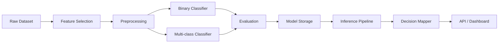

# CyberSentinel-AI — ML Pipeline Implementation Plan

A modular machine learning pipeline for network intrusion detection using the CICIDS2017 dataset.  
The system supports binary detection, multi-class attack classification, decision mapping, model persistence, and API-based inference for future integration with monitoring or security tools.

---

## Pipeline Overview



---

## Folder Structure

```
cybersentinel-ai/
├── data/
│   ├── raw/
│   └── processed/
├── models/
│   ├── binary/
│   └── multiclass/
├── src/
│   ├── features/
│   ├── training/
│   ├── evaluation/
│   ├── policy/
│   ├── inference/
│   └── api/
├── configs/
├── notebooks/
└── tests/
```

---

## Stage 1 — Feature Selection

Goal: Reduce feature count while preserving predictive power.

Methods used:

- Variance threshold
- Correlation filtering
- Tree-based feature importance
- Statistical selection

Selected features saved to:

```
data/processed/selected_features.json
```

---

## Stage 2 — Preprocessing

Steps:

- Train / validation / test split
- Standard scaling
- Encoding labels
- Persist scaler

Artifacts saved:

```
scaler.pkl
X_train.parquet
X_val.parquet
X_test.parquet
```

---

## Stage 3 — Binary Classification

Task:

```
Benign vs Attack
```

Models:

- RandomForest
- XGBoost
- LogisticRegression

Class imbalance handled using:

```
class_weight or SMOTE
```

Model saved to:

```
models/binary/
```

---

## Stage 4 — Multi-class Classification

Task:

```
Predict attack type
```

Examples:

- DDoS
- PortScan
- Botnet
- Web Attack
- DoS

Used only when binary = attack.

Model saved to:

```
models/multiclass/
```

---

## Stage 5 — Evaluation

Metrics:

- Accuracy
- Precision
- Recall
- F1
- ROC-AUC
- Confusion Matrix

Saved to:

```
models/.../eval/
```

---

## Stage 6 — Decision Mapping

Convert predictions into actions.

Example rules:

```
Benign → ALLOW
Low-risk attack → MONITOR
High-risk attack → BLOCK
```

Implemented in:

```
src/policy/
```

Output format:

```
{
  action,
  attack_type,
  confidence,
  timestamp
}
```

---

## Stage 7 — Model Persistence

Each model folder contains:

```
model.pkl
metadata.json
feature_list.json
```

Ensures reproducible inference.

---

## Stage 8 — Inference Pipeline

Single entry point:

```
predict(input) → decision
```

Steps:

1. Validate input
2. Select features
3. Scale
4. Binary predict
5. Multi-class predict
6. Decision mapping
7. Return result

File:

```
src/inference/inference_pipeline.py
```

---

## Stage 9 — API

FastAPI wrapper.

Endpoints:

```
POST /predict
GET /health
GET /model-info
```

Location:

```
src/api/main.py
```

---

## Future Work

- Dashboard visualization
- Model comparison
- Hyperparameter tuning
- Streaming input support
- Docker deployment
  